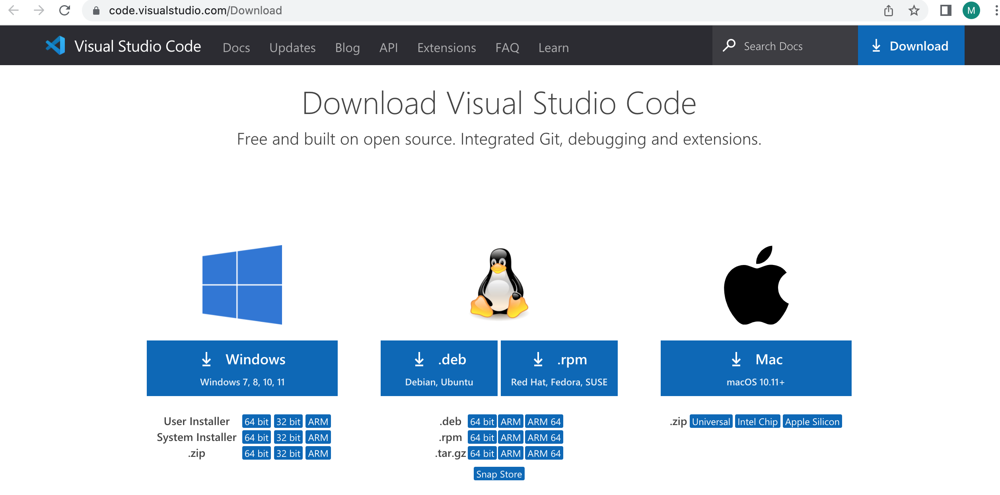
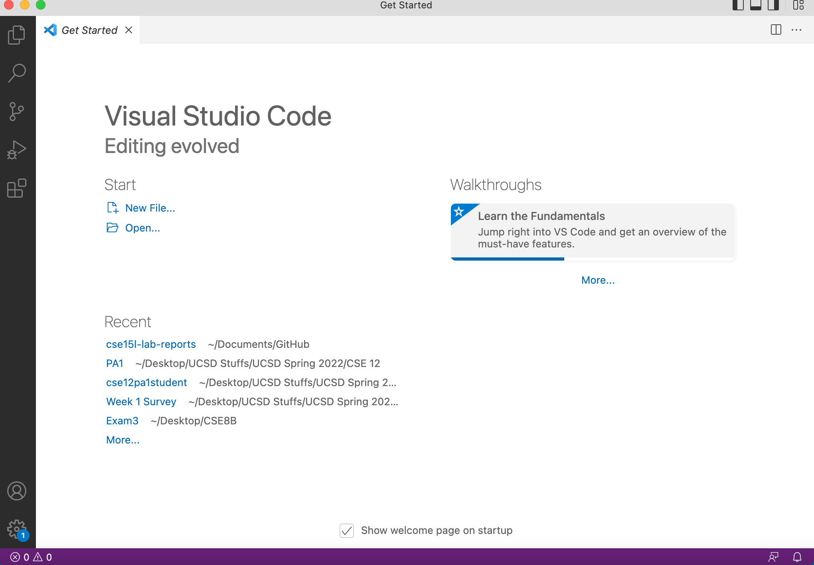
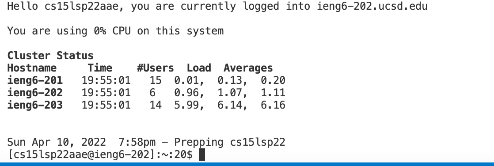
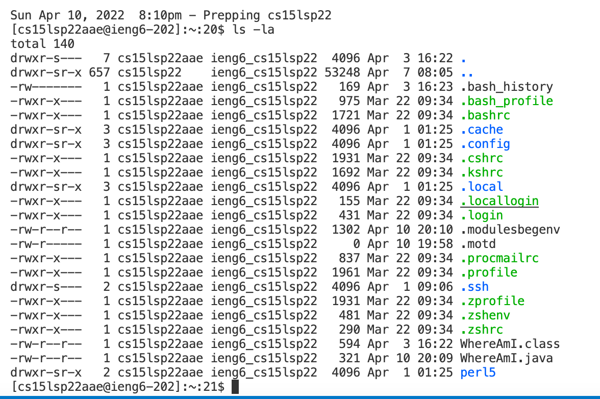
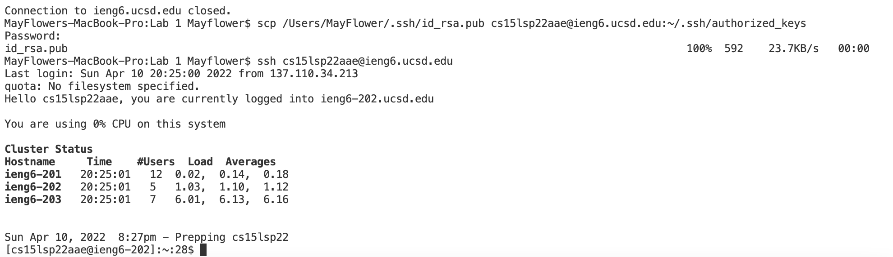
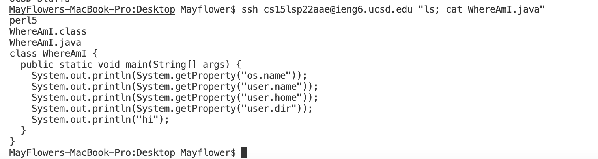

# MacOS Remote Access Tutorial
by May Chenh

**Step 1:** Install VSCode

First, install VSCode. VSCode is a popular IDE that lets users write and edit code easily. You can download this application with this [link](https://code.visualstudio.com/Download). Make sure to choose the option that corresponds to your OS.

Open the file after it's done downloading and follow all of the on-screen instructions to install the IDE. When finished, you should see something that looks like this.

**Step 2:** Remotely Connect

Remotely connecting allows you to use your local computer to access a remote computer over the Internet and do work remotely from where you are. Typically, you will have an unique account given to you. For this class, you can look up your course-specific account with this [link](https://sdacs.ucsd.edu/~icc/index.php). Use the username you usually use for your other accounts (this is usually first initial and last name).

Under "additional accounts" you should see your usernames for your other accounts. For 15L, it should be the one that starts with cs15lsp22 followed by three letters. (The sp22 part might change to correspond with your quarter). If this is your first time using this account, you will need to set your password up by pressing "Change your Password" for this account and following the instructions.

Next, open a terminal and input the following command. Make sure to replace "cs15lsp22zz" with your username that you just found.

$ ssh cs15lsp22zz@ieng6.ucsd.edu

When prompted with your password, type in the password you just set up. Nothing will show up in the terminal, but this is normal. Write your password and press enter.

Say yes when prompted with the following message: 
"Are you sure you want to continue connecting (yes/no/[fingerprint])?"

When successfully logged in, you should see something similar to this. This means you can now use the terminal on the client (your computer) to run commands on the server (the computer in the CSE basement).

**Step 3:** Try Out Basic Commands

Now you can test out some basic commands! You can try both on your computer and the remote computer. To logout of the server, you can CTRL + D or write logout. Then the commands will be run on the client.

- **cd**: lets you change directories and move around the directories to look for files
- **ls**: gives a list of all the files in the current directory
- **pwd**: gives you the path of where you currently are
- **mkdir**: makes a new directory or folder
- **cp**: lets you copy files
- **man**: provides a manual for certain commands

For example, I will list out the folders on my desktop with the ls command:

**Step 4:** Move Files with scp

To copy files from the client to the server, we will run the scp command on the **client**. From the directory where the file is located, run this command. Remember to replace cs15lsp22zz with your username:

$ scp FileName.java cs15lsp22zz@ieng6.ucsd.edu:~/

You should see something that looks like this:

Then to check if it worked, log back into the remote computer and list out the files.

We can see that the file we copied over is listed here in the home directory of the remote computer!

**Step 5:** Set up a SSH Key

It's such a hassle having to enter your password each time you want to log into the server. You can skip this step by setting up SSH keys. You can create a pair of files (public key and private key) that will replace the need for a password. The private key will be located on the client and the public one on the server. To do so, use the following command on the client:

$ ssh-keygen

** Make sure you don't add a passphrase and just press enter

Now copy the public key to the .ssh directory on the remote computer. Log into the server with ssh and make the .ssh directory:

$ mkdir .ssh

Then logout and run the following command on the client to copy the public key to the server:

$ scp /Users/< user-name >/.ssh/id_rsa.pub cs15lsp22zz@ieng6.ucsd.edu:~/.ssh/authorized_keys

**Make sure to replace the neccessary information with your own information. For example, your username and the path.

You should now be able to ssh into the remote computer without needing a password!

**Step 6:** Optimize Remote Running
To optimize and save time, you can try out the following tips:
- Save (or even memorize) your information (like your username) or terminal commands somewhere accessible
- Use the up arrow key to look at previous commands you used
- Use semicolons to run multiple commands with one line
- Write commands with quotes after an ssh command to run them on the remote server and exit with one line on the client

Here, we ssh into server, run the ls command to list the files in the directory and output the contents of a file all in one line:

