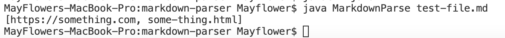
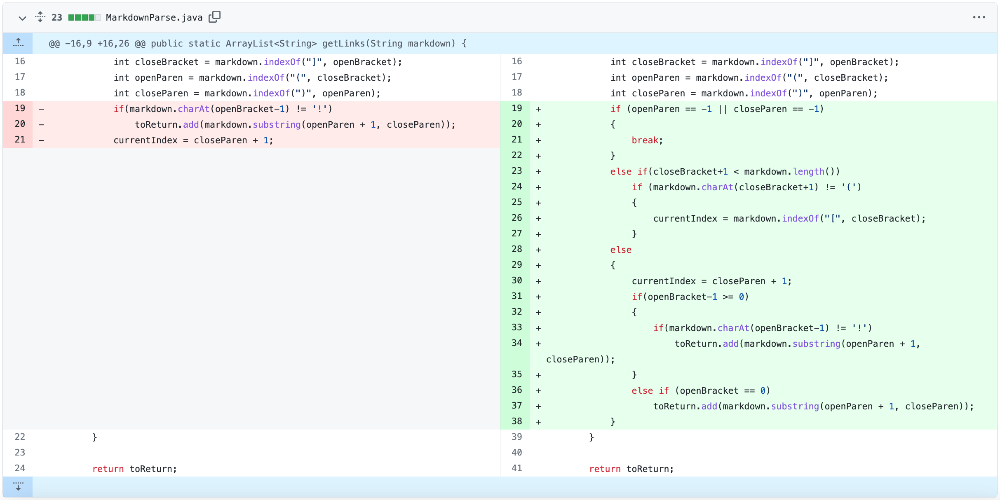

# Debugging MarkdownParse.java

## Bug #1

[Link](https://github.com/m-chenh/markdown-parser/commit/69aade06f18602090617a608503e69c2f2726c00) to **test file's first commit.**

You can find the **Failure-inducing test-file** [here.](https://github.com/m-chenh/markdown-parser/blob/69aade06f18602090617a608503e69c2f2726c00/test-file.md)

**Symptom of the program after using the above file as the input:**

**Explanation** 
There were two symptoms that were visible after running the program with the test file above. The first being an abnormally long runtime and the second being an "OutofMemoryError: Java heap space" message. This symptom was caused by a bug. The bug being an infinite while loop. In the original code, the while loop would continue running as long as `currentIndex < markdown.length()`. However, since currentIndex was being assigned to the index after the next close parenthesis, it would always be smaller than the length of the file unless there was a close parenthesis at the very end of the file. Thus the program fails when adding extra new lines or spaces in the input file at the end. Since the while loop keeps on going, we run out of memory in the heap.

**Screenshot of the code change differences from Github:**

**Correct output after fixing the bug:**

**Why this works:**
By adding the extra condition to the while loop, it makes sure that the program breaks out of the while loop when there are no more open brackets to be found in the input file. The return value of `indexOf()` is `-1` when it can't find the String. Thus, this fixes the infinite while loop.

## Bug #2
[Link](https://github.com/m-chenh/markdown-parser/commit/0d3b84c75f32a78dffb335e57be1602fdce3eb21) to **test file's second commit.**

You can find the **Failure-inducing test-file** [here.](https://github.com/m-chenh/markdown-parser/blob/0d3b84c75f32a78dffb335e57be1602fdce3eb21/test-file.md)

**Symptom of the program after using the above file as the input:**

**Explanation** The symptom was incorrect output. We can see that instead of simply printing out an array with the two links from the file, the program printed out 3 links. The third "link" being the image file. This is due to a bug. The bug is that the program looks through the file for the next open bracket and close bracket. Then it looks for the next open and close parenthesis, adding the string between the parenthesis (the link) to the array of links. However, the syntax in markdown between a link and an image is very similar. The only difference is that the image has an exclamation mark before the open bracket. This means the while loop would recognize the image file name or path as a link because it doesn't account for the exclamation mark. Therefore, when adding in an image in the text file, aka adding an exclamation mark before the open bracket, the program would print out the file name too as seen by the symptom.

**Screenshot of the code change differences from Github:**

**Correct output after fixing the bug:**

**Why this works:**
By adding this if statement, it checks to make sure that there isn't an exclamation mark before the open bracket before adding the substring to the array of links. If there is, the "link" is an image file or path, so the program would move on to the next open bracket. Thus, this fixes the output by making sure images aren't included.

## Bug #3

[Link](https://github.com/m-chenh/markdown-parser/commit/8387d0168e3b010e03b838e8fd9161d1e4b884ab) to **test file's third commit.**

You can find the **Failure-inducing test-file** [here.](https://github.com/m-chenh/markdown-parser/blob/8387d0168e3b010e03b838e8fd9161d1e4b884ab/test-file.md)

**Symptom of the program after using the above file as the input:**

**Explanation** 
There were two symptoms that were visible after running the program with the test file above. The first being an abnormally long runtime and the second being an "OutofMemoryError: Java heap space" message. This symptom was caused by a bug. The bug being an infinite while loop. In the previous code, the while loop would continue running when it can't find a parenthesis after finding an open bracket. This is because the return value of the `indexOf()` method would return -1 when looking for the close parenthesis, which would mean `currentIndex = closeParen + 1` would equal 0 and the while loop would continue on as `currentIndex = 0` would always be less than the length of the file and the  value of `markdown.indexOf("[", currentIndex)` wouldn't be -1 as there is an open bracket to be found. Thus, when using a test file that utilizes the open and close brackets in the text without making it a link, the program would result in an error as there are no parenthesis to find.

**Screenshot of the code change differences from Github:**

**Correct output after fixing the bug:**

**Why this works:**
The first if statement makes sure that there are parenthesis in the rest of the file in the case the input text file has stuff written in brackets that is not the title of a link. Otherwise, the while loop would break, thus fixing the infinite while loop.