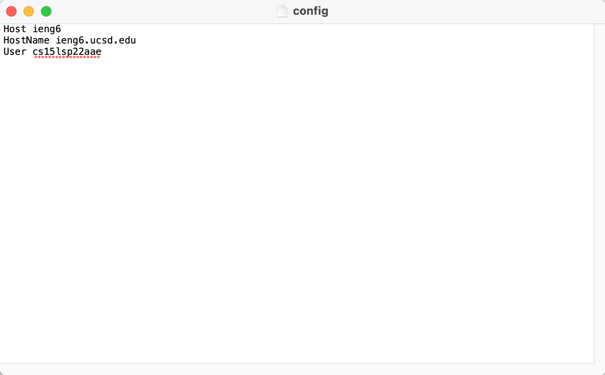
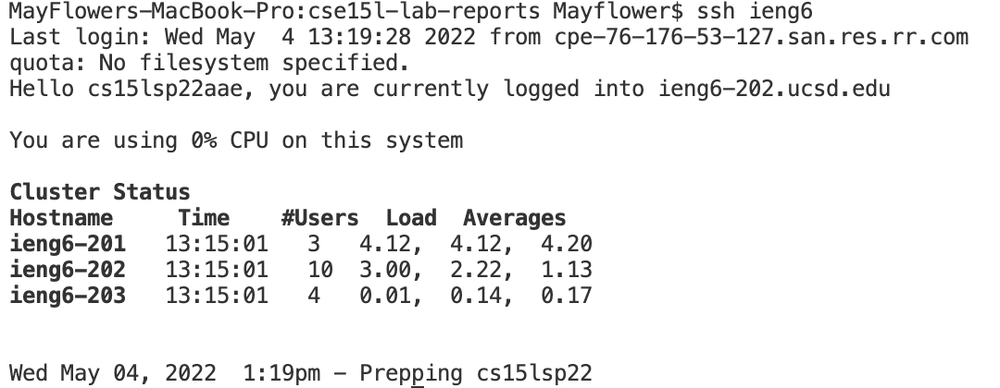
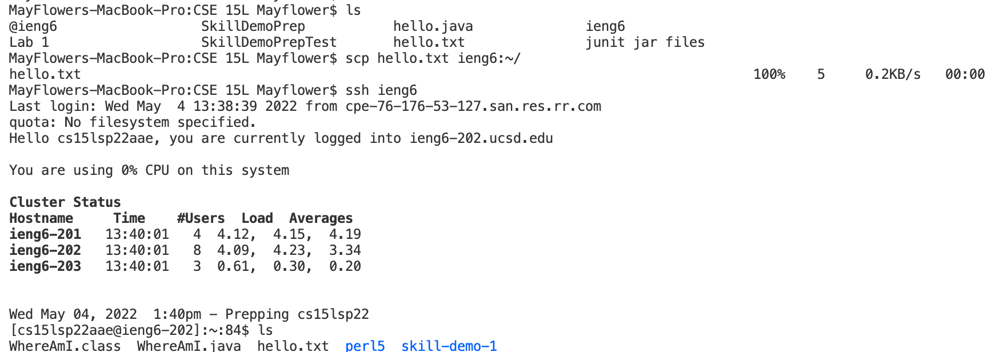
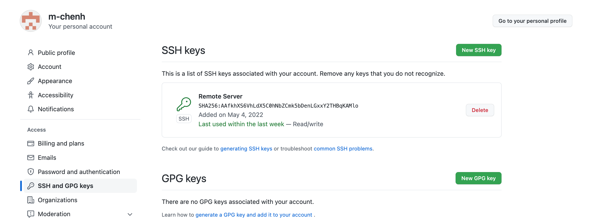
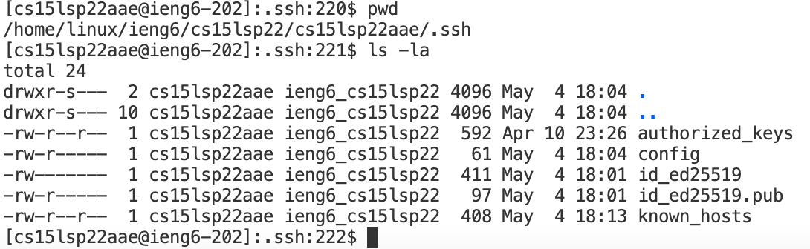
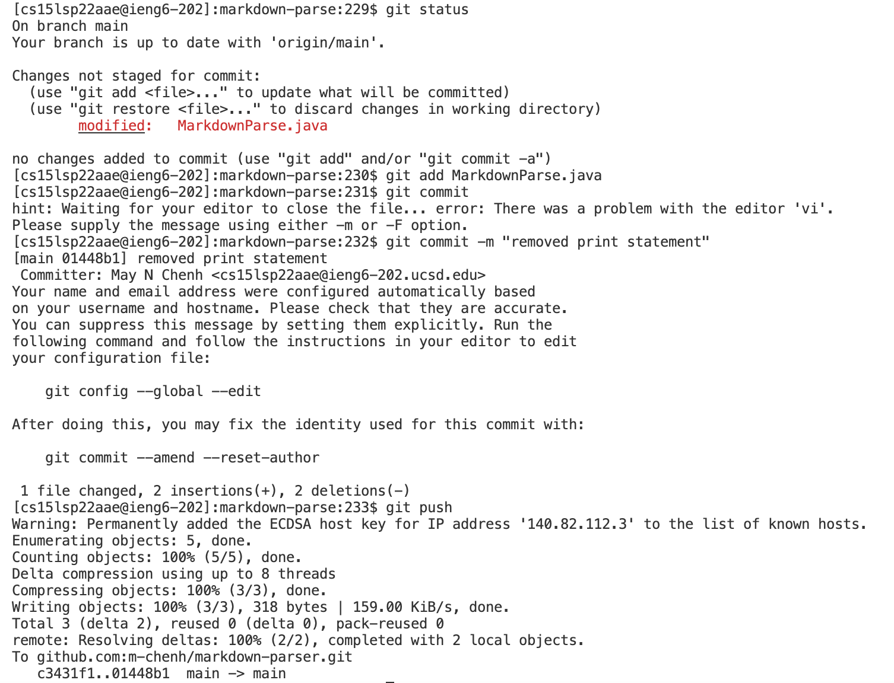
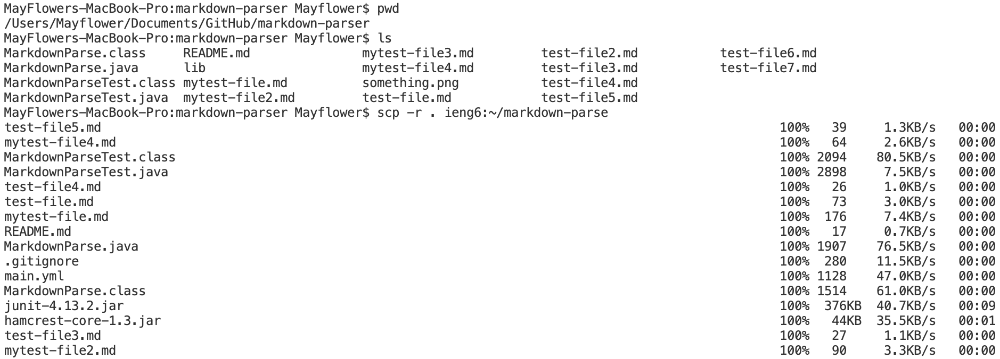
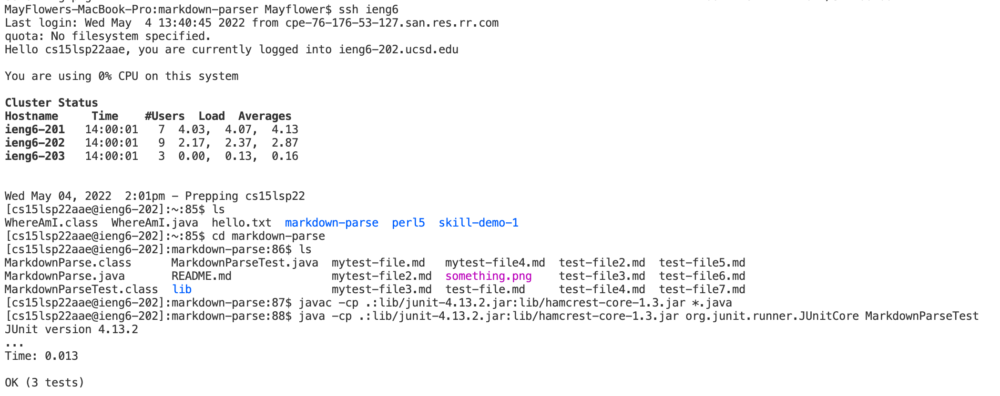

# How to: ssh Efficiently, Use Github on a Remote Server, and scp Whole Directories

## Streamline ssh Configuration
So far, we've been using the following command to log into the remote server:

    $ ssh cs15lsp22zzz@ieng6.ucsd.edu
To make this more efficient, we could remove the need to input our course-specific username in the command. By adding an entry to our ssh configuration file, we're telling ssh what username to use for different servers.

**Step 1:** Create a configuration file in your .ssh directory. 

```
// if you don't have a .ssh directory
$ cd Users/<user-name>
$ mkdir .ssh
$ cd .ssh

//Otherwise, you can cd directly into the .ssh directory
$ cd ~/.ssh

// create a config file
$ touch config
```

**Step 2:** Edit the configuration file.

    $ open -t config

A plain text box should open up on your Mac's TextEdit application. Input the following lines:
```
Host ieng6
HostName ieng6.ucsd.edu
User cs15lsp22zzz (use your username)
```
It should look like so:


**Step 3:** Test it out with ssh.

Now we can test it out! All you need is the host name's alias:

As you can see, all I wrote was `ssh ieng6` and it worked! I no longer need to use my username since the configuration file knows which username is associated with this server. I named the server ieng6, but you can name it whatever you'd like in the first line of the entry in the configuration file.

**Step 4:** Test it out with scp.

First I created a file called hello.txt and from the location where that file was created, I used the scp command to copy the file over to the home directory of the server. Then I logged into the server to check if it was there. As you can see, I no longer need to use my username when copying over file. I just the file name and host server's alias name and the location I want the file copied to.

## Setup Github Access from ieng6
You can't use git commands in terminal on the remote server without first setting up access to Github. We can do this by making a new SSH key to access Github.

**Step 1:** Make a new SSH key.

    $ ssh-keygen -t ed25519 -C "your_email@example.com"

When prompted "Enter a file in which to save the key" press ENTER to choose the default file location.

When prompted to "Enter passphrase", press ENTER for no passphrase.

**Step 2:** Add the SSH key to the ssh-agent

    $ eval "$(ssh-agent -s)"
    $ ssh-add ~/.ssh/id_ed25519

**Step 3:** Add the SSH key to your Github account

    # Displays the contents in public key file
    $ cat ~/.ssh/id_ed25519.pub
    # Copy the output to clipboard

Then go to Github then go to settings. Under "access" click on "SSH and GPG keys" and add a new SSH key. Paste the contents in your clipboard into the given field. Then make a new key. 

The public key should be stored on Github like this:


The public key is stored in the id_ed25519.pub file on ieng6 like this in the .ssh directory:


The private key is stored in this location as well.

**Step 4:** Change the link from HTTPS url to ssh url

    $ git remote set-url origin git@github.com:<Username>/<Project>.git
Replace that link with the ssh url link found on your github repository.

**Step 5:** Test it out with git commands

First I made a change to the file. Then I added the changes so I could commit the changes with a commit message. Then I committed the changes and pushed the changes to the repository and it worked!

[Here](https://github.com/m-chenh/markdown-parser/commit/01448b13111dbe31b7ed24462d8f332b20a3a91f) is the link to the commit on Github.

## Copy whole directories with scp -r
We've learned how to copy over files one by one with scp, but what if we want to copy over a whole directory? scp lets do this with the -r option, which copies over the directory recursively to copy everything in it.

**Step 1:** Navigate to the directory you want to copy over.

**Step 2:** Copy over the directory recursively.
    
    $ scp -r . ieng6:~/markdown-parse

The -r option allows us to copy the directory recursively. The period represents "current directory".  ~/markdown-parse creates a directory on the remote server named markdown-parse if it doesn't exist and copies the directory contents there.



**Step 3:** Check that it's on the server. Compile and run the files to see if they work.


First I ssh'd into the remote server and listed out the files and directories on the home directory. As you can see, the markdown-parse directory and everything inside it was successfully copied over. Then I compiled the java files and ran the jUnit tests in the markdown parse tester file, and it works! In terminal, you can see that 3 tests were run and all of them passed.

**Step 4:** Try it all with one command by using semicolon.

First write the scp command to copy over the directory recursively, then use a semicolon and write the ssh command to login to the remote server. Then the rest will be in quotes in order to run these commands directly on the remote server. Write the cd command to change directory into the directory we just copied over, and then use a semicolon and write the javac and java command (with a semicolon between them) to compile and run the files directly on the remote server then exit.
