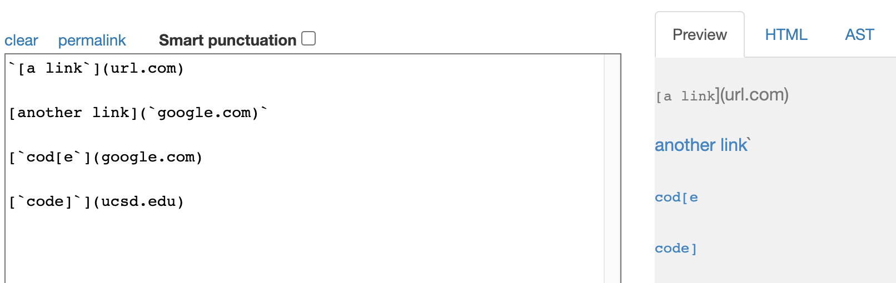
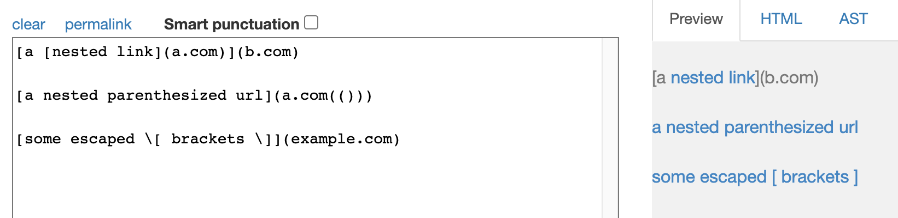
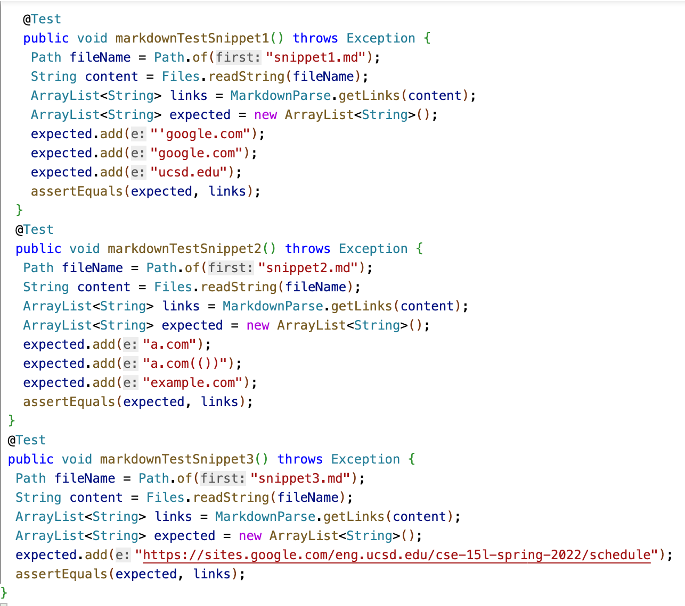
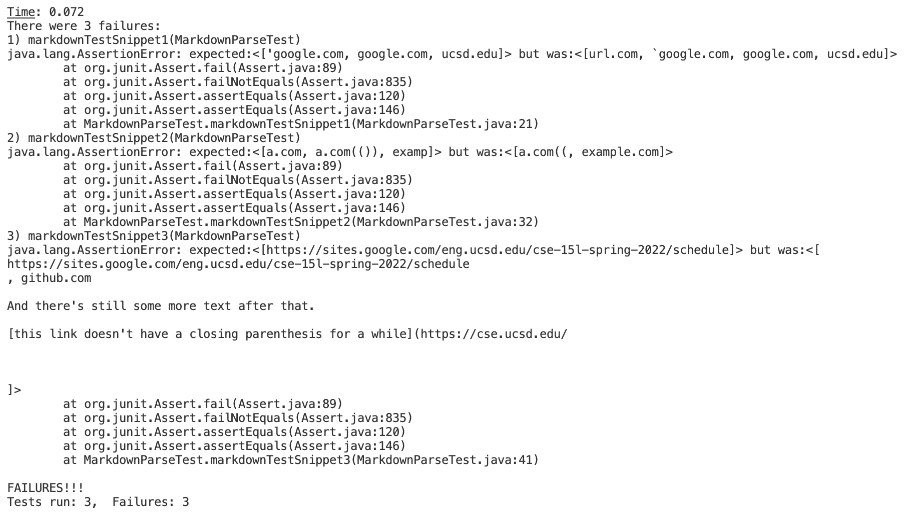

# Testing and Debugging markdown-parser

For reference:

[Here](https://github.com/m-chenh/markdown-parser) is a link to my markdown-parser repository.

[Here](https://github.com/HantianLin/markdown-parser) is a link to my group mate's markdown-parser repository that we reviewed in week 7's lab

## Determining Expected Output
Using the [CommonMark demo site](https://spec.commonmark.org/dingus/), we can visualize the expected output of the test files.

**Snippet 1:**

Only the last 3 links became links in the output. That means we should expect an array that looks like:

`['google.com, google.com, ucsd.edu]`

**Snippet 2**

The link in the first pair of parenthesis becomes a link in the output. The links in the last two lines also become links. We should expect an array that looks like:

`[a.com, a.com(()), example.com]`

**Snippet 3**

Only one of the links become a link in the output. This is the one that gets titled "this title text is really long and takes up more than one line". We should expect an array that looks like:

`[https://sites.google.com/eng.ucsd.edu/cse-15l-spring-2022/schedule]`

## Writing the tests in MarkdownParseTest.java

For each of the snippets, we created a test by using the getLinks() method we wrote in MarkdownParse.java on that snippet test file. We then took that output and used AssertEquals to see if it matched our expected ouutput that we determined earlier.

## My Implementation's jUnit Output

As you can see, none of the tests passed. For Snippets 1 and 2, the jUnit output tells us it was an OutOfMemory error. For Snippet 3, the jUnit output tells us that our actual output didn't match our expected output.

## The Implementation We Reviewed in Week 7 jUnit Output

As you can see, none of the tests passed. For all 3 snippets, the expected output didn't match our actual output.

## Answering Questions About the Code
**My implementation:**
1. Do you think there is a small (<10 lines) code change that will make your program work for snippet 1 and all related cases that use inline code with backticks? If yes, describe the code change. If not, describe why it would be a more involved change.

For my implementation of MarkdownParser, I doubt that there is a small code change that would make my program work for snippet 1 because not only would we have to account for the backticks, but we'd also have to fix the infinite while loop. First, we'd have to find the indices of all the starting backticks and the indices of the corresponding backtick. Then we'd have to check if the any part of the link is within the inline code. This fix in itself might be a small code change, but then we'd have to account for the extra close bracket in the last line of snippet 1. To do so, we'd have to make sure we choose the correct closing bracket that corresponds to the open bracket. In addition, there might be extra backticks in the test file that could mess up our algorithm that looks for inline code. It also matters how much of the link is in inline code. If the extra brackets are within the inline code, it would be ignored by the algorithm that looks for the closing bracket, and the while loop wouldn't go on infinitely.

2. Do you think there is a small (<10 lines) code change that will make your program work for snippet 2 and all related cases that nest parentheses, brackets, and escaped brackets? If yes, describe the code change. If not, describe why it would be a more involved change.

For my implementation, I don't think that there is a small code change that could make my program work for snippet 2. This is because we'd have to account for nested parentheses/brackets, and escaped brackets, and fix the infinite while loop. To do so, we'd have to first start with the opening bracket or parentheses and then find the correct corresponding closing bracket or parentheses. We'd have to make sure that it's the last closing parenthesis with no other closing parenthesis in the index after it. We'd have to make sure that the closing bracket has a open parenthesis in the index after it. We have to check if there is a backslash in the index before the brackets, which affects whether or not that bracket will be included. In addition, there might be extra parentheses or brackets, which means they won't have a corresponding one, and it could mess up the algorithm. This could mean it causes an infinite while loop when it can't find the corresponding pair. We can fix this by looking to the next link when there isn't a closing parenthesis, but we have to make sure that it doesn't steal a closing parenthesis from the next link.

3. Do you think there is a small (<10 lines) code change that will make your program work for snippet 3 and all related cases that have newlines in brackets and parentheses? If yes, describe the code change. If not, describe why it would be a more involved change.

For my implementation, I think it might be possible to have a small code change of less than 10 lines to make my program work for snippet 3 and other cases that have newlines. This is because we'd just have to check that there aren't any new lines within the open and close brackets and the open parenthesis and close parenthesis. We'd also check that the open parenthesis is in the index right after the close bracket. The only questionable part is making sure that if there's a missing parentheses that we don't steal it from the next link and print everything in between.

**The implementation we reviewed in week 7:**
1. Do you think there is a small (<10 lines) code change that will make your program work for snippet 1 and all related cases that use inline code with backticks? If yes, describe the code change. If not, describe why it would be a more involved change.

For the implementation of MarkdownParser that we reviewed in week 7, I still doubt that there is a small code change that would make the program work for snippet 1. This is due to the same issues. First, we'd have to find the indices of all the starting backticks and the indices of the corresponding backtick. Then we'd have to check if the any part of the link is within the inline code. 
It matters how much of the link is in the inline code. If the extra brackets are within the inline code, for example, they would be included in the title, but ignored in the algorithm that looks for a close bracket. In addition, there might be extra backticks in the test file that could mess up our algorithm that looks for inline code. 

2. Do you think there is a small (<10 lines) code change that will make your program work for snippet 2 and all related cases that nest parentheses, brackets, and escaped brackets? If yes, describe the code change. If not, describe why it would be a more involved change.

For the implementation of MarkdownParser that we reviewed in week 7, I still doubt that there is a small code change that would make the program work for snippet 2 due to similar problems. This is because we'd have to account for nested parentheses/brackets and escaped brackets. In the output, we didn't include the first link, and we didn't include the closing parentheses in the second link. We have to make sure that when we're looking at the closing parenthesis that it's the last one, which means there aren't any closing parentheses in the indeces right after it. We'd have to make sure that the closing bracket has a open parenthesis in the index after it, and we add the link within. We have to check if there is a backslash in the index before the brackets, which affects whether or not that bracket will be included. In addition, there might be extra parentheses or brackets, which means they won't have a corresponding one, and it could mess up the algorithm. This could mean it causes an infinite while loop when it can't find the corresponding pair. We can fix this by looking to the next link when there isn't a closing parenthesis, but we have to make sure that it doesn't steal a closing parenthesis from the next link.

3. Do you think there is a small (<10 lines) code change that will make your program work for snippet 3 and all related cases that have newlines in brackets and parentheses? If yes, describe the code change. If not, describe why it would be a more involved change.

For the implementation of MarkdownParser that we reviewed in week 7, I think it might be possible to have a small code change of less than 10 lines to make my program work for snippet 3 and other cases that have newlines. This is because we'd just have to check that there aren't any new lines within the open and close brackets and the open parenthesis and close parenthesis. We'd also check that the open parenthesis is in the index right after the close bracket. The only questionable part is making sure that if there's a missing parentheses that we don't steal it from the next link and print everything in between.