# Comparing Two Different Implementations

## Get the Output
**Step 1:** Compile the java files using makefile. Use the following command:
`make test`

This is what the makefile looks like:
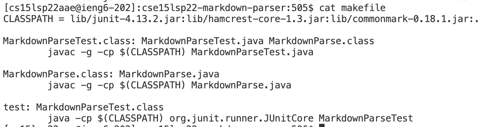

**Step 2:** Run both MarkdownParse.java files with all the provided test files using a bash script in order to see the implementations' output.

Here's what the bash script looks like:
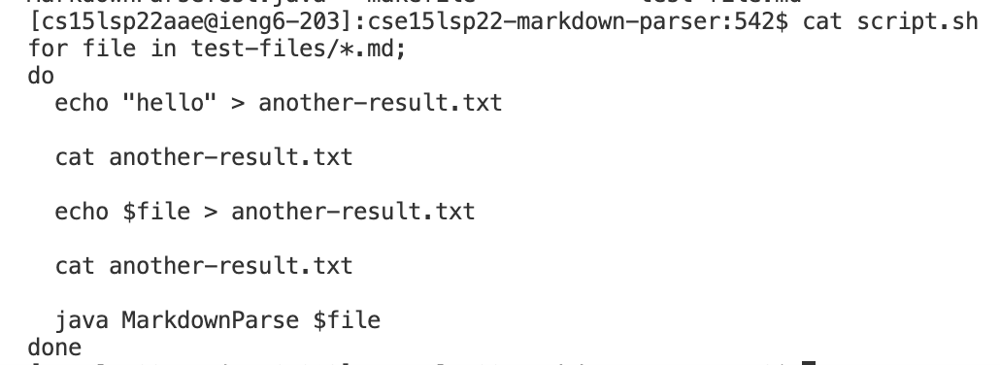
The bash script uses a for loop to go through all the files provided in the test-files directory and runs MarkdownParse with each test file. Make sure you have the test-file directory with all the test files and the bash script in both workspaces of MarkdownParse you are comparing.

Use the following command in terminal in both workspaces to run the bash script and put the output into its own file named results.txt: `bash script.sh > results.txt`

## Compare the Results Using vimdiff
Now that we have the output of the two different implementations in two results.txt files, we can compare the differences between the outputs line by line using vimdiff. Run the following command:

```$ vimdiff my-markdown-parser/results.txt cse15lsp22-markdown-parser/results.txt```

Here's the output:
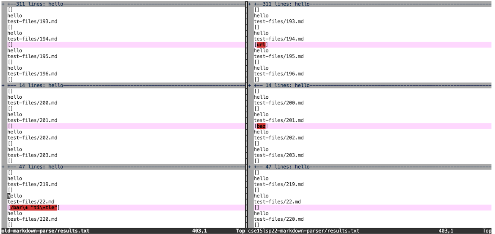
As you can see, test file 201 had different results and test file 22 had different results.

[Here](https://github.com/nidhidhamnani/markdown-parser/blob/main/test-files/201.md) is a link to test file 201.

[Here](https://github.com/nidhidhamnani/markdown-parser/blob/main/test-files/22.md) is a link to test file 22.

## Test File 201
Here is the test file and its **expected output** according to [this](https://spec.commonmark.org/dingus/?text=) markdown preview website:
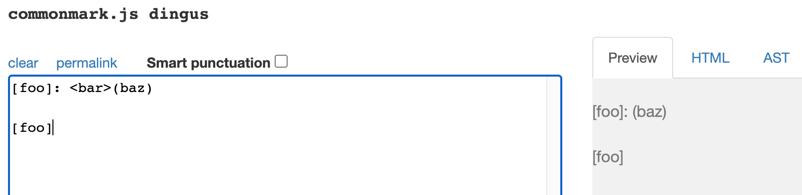
Nothing was linked in the ouput, so our expected result from MarkdownParse.java should be `[]`. This is because there is text between the close bracket and the open parenthesis.

Here are the **actual outputs**:

My implementation:
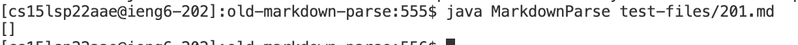

Given implementation:
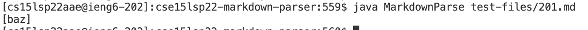

My implementation is correct because the program returns an empty array, which matches the expected output. The given implementation is incorrect because it returns baz in the array, but baz is not considered a link by markdown in this case.

Here is the **bug** in the code that should be fixed:
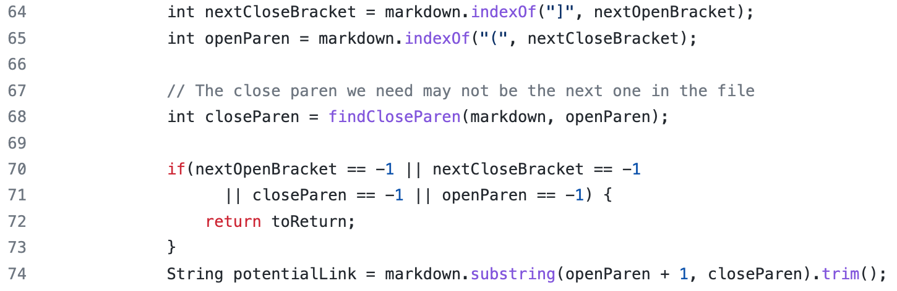
In line 64, we find the close bracket. Then in line 65, we find the open parentheses. Then we find the close parentheses by calling the helper function. As long as these values are found in the file, then we get the substring between the open and close parentheses and add it to the array. This is a problem because the code doesn't account for if there's text or space between the close bracket and the open parenthesis. This means it will consider the text inside the parentheses as a link when it shouldn't. To fix this, we could add another if statement that checks to see if the open parenthesis is in the index right after the close bracket.

## Test File 22
Here is the test file and its **expected output** according to [this](https://spec.commonmark.org/dingus/?text=) markdown preview website:
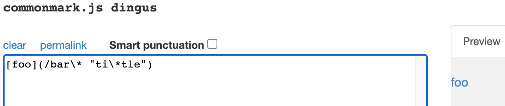
The output does consider the input a link (it's highlighted in blue), which means our expected result from MarkdownParse.java would be `[bar*]`.

Here are the **actual outputs**:

My implementation:
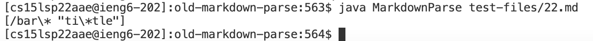

Given implementation:
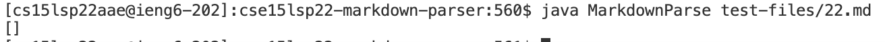

My implementation is incorrect because it consideres the entire text between the parentheses as a link. Only part of the text is used as the link in the ouput. The given implementation is incorrect because it returns an empty array even though part of the text is considered a link in markdown.

Here is the **bug** in the code that should be fixed:
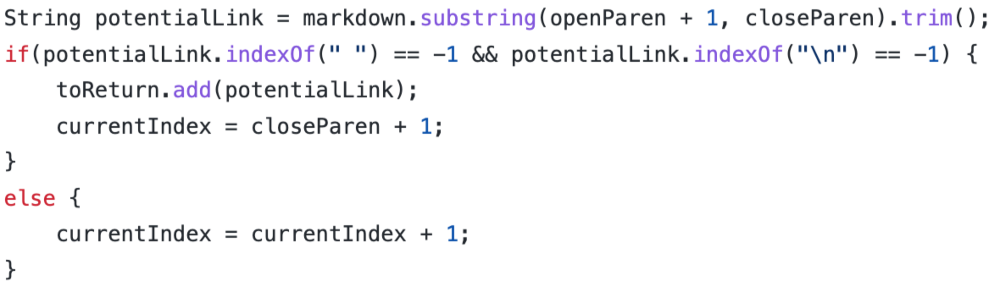
The first line takes the text between the parentheses. Then it checks that there aren't any spaces or new lines in that text. If there aren't, then we consider it a link and add it to the array of links. If there are, then we move on to look for the next link. However, the output does seem to show that markdown does consider the text inside the file to be a link. This means, just because there's a space in the text between the parentheses, that doesn't mean that there isn't a link there. We could fix this by removing that first part in the if statement.